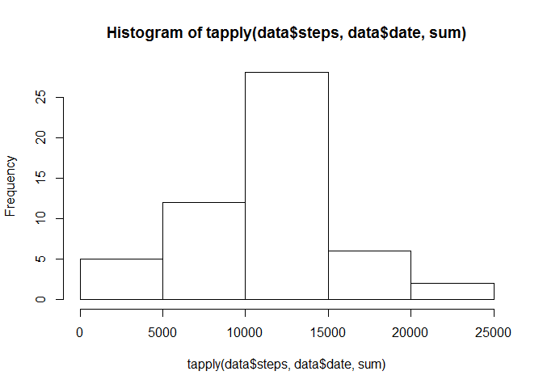
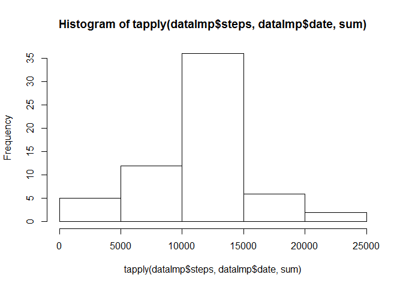
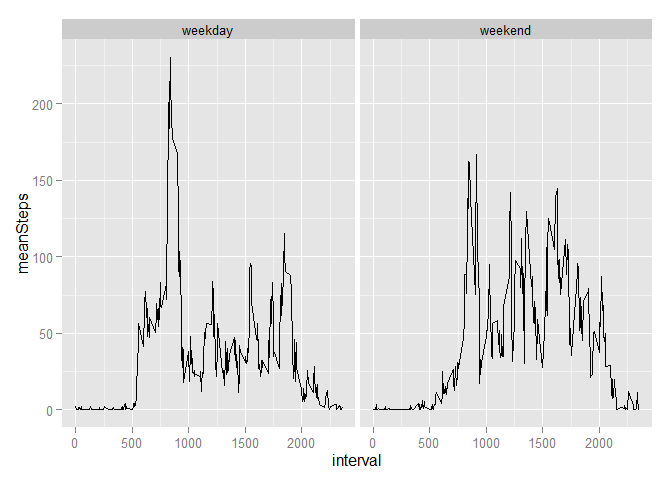

# Reproducible Research: Peer Assessment 1
## Seting up the environment
Here we load the libraries that will help us with the process

```r
library(readr)
```

```
## Warning: package 'readr' was built under R version 3.1.3
```

```r
library(dplyr)
```

```
## 
## Attaching package: 'dplyr'
## 
## The following object is masked from 'package:stats':
## 
##     filter
## 
## The following objects are masked from 'package:base':
## 
##     intersect, setdiff, setequal, union
```

```r
library(ggplot2)
Sys.setlocale("LC_TIME", "English") #windows
```

```
## [1] "English_United States.1252"
```

## Loading and preprocessing the data
Here we load the data from the compressed file with the help of the read_csv function:

```r
data <- read_csv("activity.zip", col_types=list(
  steps = col_integer(),
  date = col_date(),
  interval = col_integer()))
```

And here we look at the data loaded

```r
summary(data)
```

```
##      steps             date               interval     
##  Min.   :  0.00   Min.   :2012-10-01   Min.   :   0.0  
##  1st Qu.:  0.00   1st Qu.:2012-10-16   1st Qu.: 588.8  
##  Median :  0.00   Median :2012-10-31   Median :1177.5  
##  Mean   : 37.38   Mean   :2012-10-31   Mean   :1177.5  
##  3rd Qu.: 12.00   3rd Qu.:2012-11-15   3rd Qu.:1766.2  
##  Max.   :806.00   Max.   :2012-11-30   Max.   :2355.0  
##  NA's   :2304
```


## What is mean total number of steps taken per day?

Since we would like to look the data in a daily basis, first we calculate the total steps per day and then calculate the mean for those totals:


Here is an histogram of the total number of steps taken each day:

```r
hist(tapply(data$steps, data$date, sum))
```

 

Also, we summarize the median and the mean, considering only the days that didn't have NA values:

```r
cat("Mean of the total number of steps taken per day:", mean(tapply(data$steps, data$date, sum), na.rm=TRUE))
```

```
## Mean of the total number of steps taken per day: 10766.19
```

```r
cat("Median of the total number of steps taken per day:", median(tapply(data$steps, data$date, sum), na.rm=TRUE))
```

```
## Median of the total number of steps taken per day: 10765
```

## What is the average daily activity pattern?
Time series plot of the 5-minute interval (x-axis) and the average number of steps taken, averaged across all days (y-axis)


```r
tmp=dplyr::group_by(data, interval) %>% dplyr::summarize(meanSteps=mean(steps, na.rm=T))
ggplot(tmp, aes(x = interval, y = meanSteps)) + 
    geom_line() 
```

 

Here we calculate which 5-minute interval, on average across all the days in the dataset, contains the maximum number of steps:


```r
cat("Interval  :", tmp$interval[which.max(tmp$meanSteps)])
```

```
## Interval  : 835
```

## Imputing missing values

Note that there are a number of days/intervals where there are missing values (coded as NA). The presence of missing days may introduce bias into some calculations or summaries of the data.

Here we calculate and report the total number of missing values in the dataset (i.e. the total number of rows with NAs)


```r
sum(is.na(data$steps))
```

```
## [1] 2304
```

We will impute those NA values using the median for the 5-minute interval, and then create a new dataset that is equal to the original dataset but with the missing data filled in:

```r
dataImp=dplyr::left_join(data, tmp, by="interval")
dataImp$steps=ifelse(is.na(dataImp$steps), dataImp$meanSteps, dataImp$steps)
dataImp=dataImp[1:3]
```

Now, we make a histogram of the total number of steps taken each day and Calculate and report the mean and median total number of steps taken per day.

Histogram for the imputed data:

```r
hist(tapply(dataImp$steps, dataImp$date, sum))
```

 

Mean and median of imputed data:

```r
cat("Mean of the total number of steps taken per day:", mean(tapply(dataImp$steps, data$date, sum)))
```

```
## Mean of the total number of steps taken per day: 10766.19
```

```r
cat("Median of the total number of steps taken per day:", median(tapply(dataImp$steps, data$date, sum)))
```

```
## Median of the total number of steps taken per day: 10766.19
```

We can see above that the histogram and total values don't difer significatly from the non imputed data

## Are there differences in activity patterns between weekdays and weekends?

Now, we create a new factor variable in the dataset with two levels – “weekday” and “weekend” indicating whether a given date is a weekday or weekend day.

```r
dataImp$wday= as.integer(format(dataImp$date, "%w"))
dataImp$week=ifelse(dataImp$wday %in% c(6,0), "weekend", "weekday")
```


Finally, we make a panel plot containing a time series plot of the 5-minute interval (x-axis) and the average number of steps taken, averaged across all weekday days or weekend days (y-axis)


```r
tmp=dplyr::group_by(dataImp, week, interval) %>% dplyr::summarize(meanSteps=mean(steps))
ggplot(tmp, aes(x = interval, y = meanSteps)) + 
    geom_line()    + 
    facet_grid(.~week)
```

 
